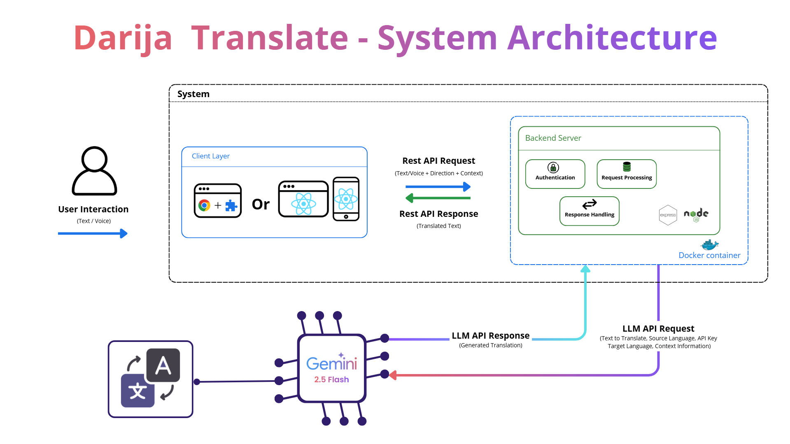
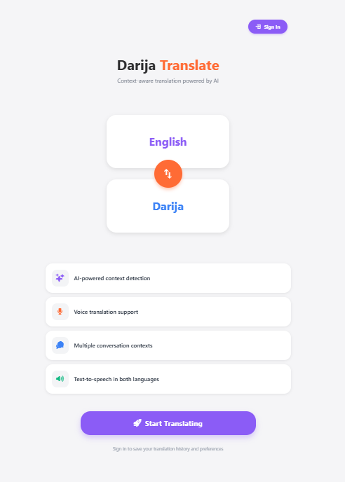
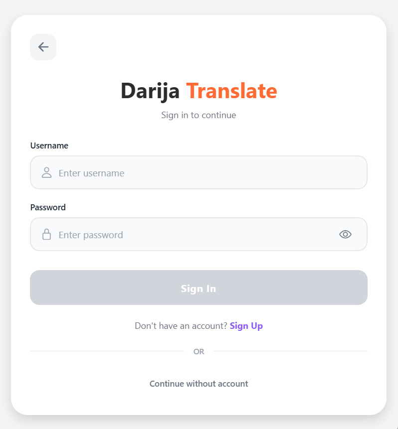
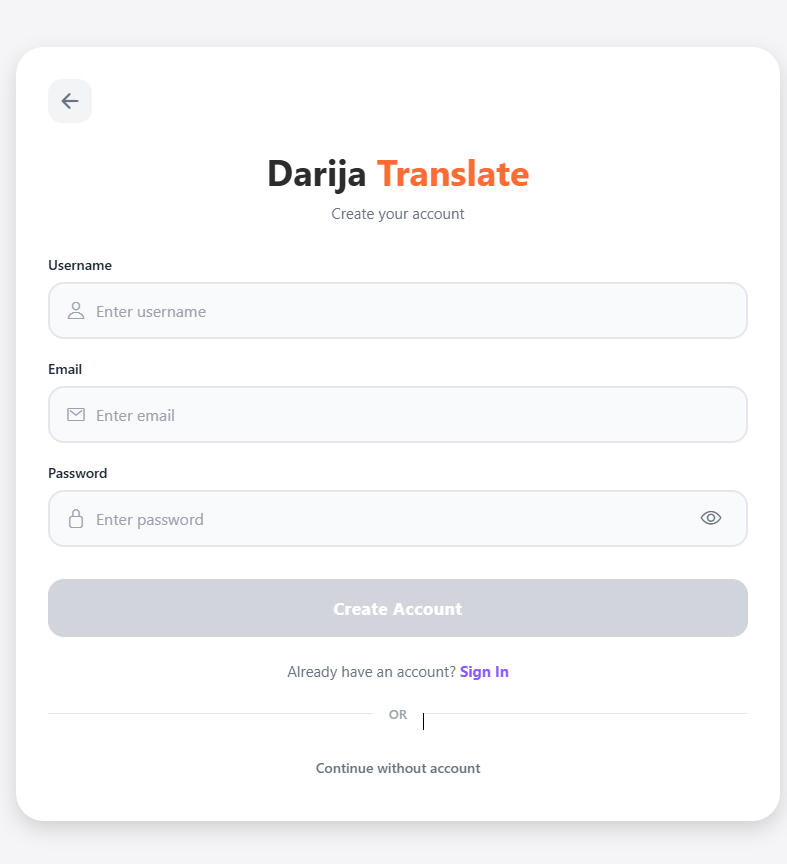
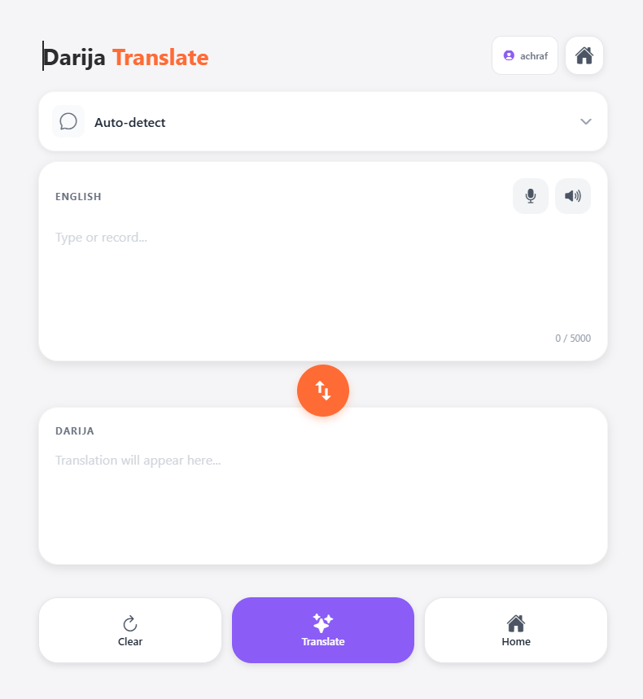
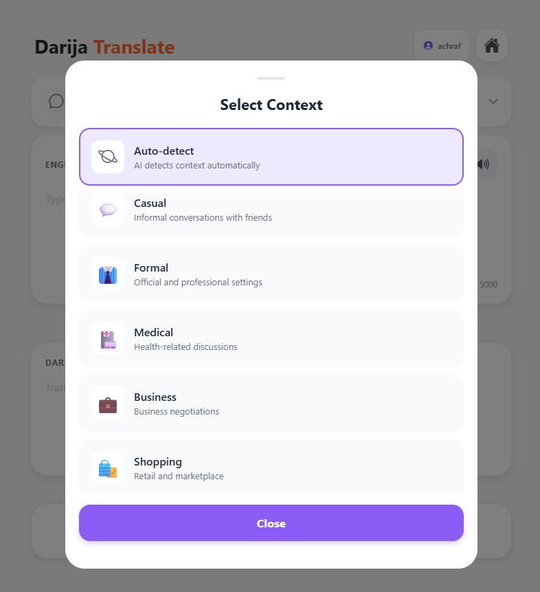
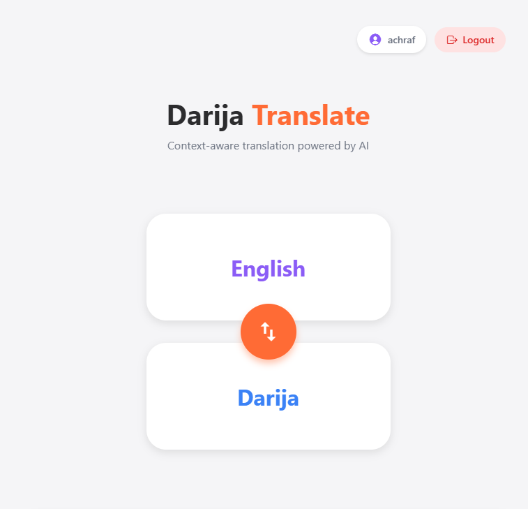

# 🌍 Darija Translate Chrome Extension

Context-aware bidirectional translation between English and Moroccan Darija (Arabic Dialect) powered by Google Gemini AI, integrated directly into your browser.



## 🎥 Demo Video

📹 [Watch Full Demo Video (11 minutes)](./demo/demo.mp4)

## 📸 Screenshots

### Home Page


### Login Page


### Sign Up Page


### Translation Page


### Other Pages



## Features

- 🌐 **Side Panel Integration** - Translate without leaving your current page
- 🔄 **Bidirectional Translation** - English ⇄ Darija
- 🤖 **AI Context Detection** - Automatic context detection (casual, formal, medical, etc.)
- 🔊 **Text-to-Speech** - Listen to translations in both languages
- 🎯 **Right-Click Translation** - Translate selected text from context menu
- 🔐 **Secure Authentication** - User sessions with JWT
- ⚙️ **Configurable API URL** - Connect to your backend deployment

### Tech Stack

#### **Frontend (Chrome Extension)**
- HTML5, CSS3, JavaScript (ES6+)
- Chrome Manifest V3
- Side Panel API
- Material Design Icons
- Web Speech API

#### **Backend**
- Node.js 18+
- Express.js
- Google Gemini API
- bcrypt (password hashing)
- JSON Web Tokens (JWT)

#### **DevOps**
- Docker & Docker Compose
- Environment configuration

## 🚀 Quick Start

### Prerequisites

- Node.js 18+ installed
- Chrome browser (latest version)
- Google Gemini API key ([Get one here](https://makersuite.google.com/app/apikey))

### 1️⃣ Backend Setup

```bash
# Clone repository
git clone https://github.com/YOUR_USERNAME/darija-translate.git
cd darija-translate

# Install dependencies
cd backend
npm install

# Configure environment
cp .env.example .env
# Edit .env and add your GEMINI_API_KEY

# Start server
npm start
```

The backend will run on `http://localhost:3000`

### 2️⃣ Docker Setup (Alternative)

```bash
# Using Docker Compose
docker-compose up -d

# Or build manually
docker build -t darija-translate-api .
docker run -p 3000:3000 -e GEMINI_API_KEY=your_key darija-translate-api
```

### 3️⃣ Chrome Extension Setup

1. **Load Extension**
   - Open Chrome: `chrome://extensions/`
   - Enable **Developer mode**
   - Click **Load unpacked**
   - Select the `extension/` folder

2. **Configure API URL** (if needed)
   - Click extension icon
   - Click ⚙️ settings button
   - Update API URL (default: `http://localhost:3000/api`)

## 📖 Usage

### Authentication

1. Click extension icon to open side panel
2. Click "Start Translating"
3. Sign up or sign in
4. Start translating!

### Translation

1. Type or paste text in input field
2. Select context or use auto-detect
3. Click "Translate" button
4. Use speaker icons for text-to-speech
5. Swap languages with ⇅ button

### Context Menu

1. Select text on any webpage
2. Right-click → "Translate with Darija Translate"
3. Side panel opens with translation

## 🔌 API Endpoints

### Authentication

```http
POST /api/auth/register
Content-Type: application/json

{
  "username": "string",
  "email": "string",
  "password": "string"
}
```

```http
POST /api/auth/login
Content-Type: application/json

{
  "username": "string",
  "password": "string"
}
```

### Translation

```http
POST /api/translate
Authorization: Bearer {token}
Content-Type: application/json

{
  "text": "string",
  "direction": "en-to-darija" | "darija-to-en",
  "context": "casual" | "formal" | "medical" | ... (optional)
}
```

**Response:**
```json
{
  "success": true,
  "data": {
    "originalText": "How are you?",
    "translatedText": "كيفاش داير؟",
    "context": "casual",
    "contextConfidence": 0.95,
    "direction": "en-to-darija",
    "timestamp": "2025-01-10T12:00:00Z"
  }
}
```

## 📁 Project Structure

```
darija-translate/
├── backend/                    # Node.js backend
│   ├── src/
│   │   ├── config/            # Gemini API config
│   │   ├── controllers/       # Request handlers
│   │   ├── middlewares/       # Auth, CORS, validation
│   │   ├── models/            # User model
│   │   ├── routes/            # API routes
│   │   ├── services/          # Business logic
│   │   └── utils/             # Constants, prompts
│   ├── app.js                 # Express app
│   ├── server.js              # Server entry point
│   ├── package.json
│   ├── Dockerfile
│   └── .env.example
│
├── extension/                  # Chrome extension
│   ├── manifest.json          # Extension config (Manifest V3)
│   ├── background.js          # Service worker
│   ├── sidepanel.html         # UI structure
│   ├── sidepanel.css          # Styles
│   ├── sidepanel.js           # Logic
│   ├── icon-generator.html    # Icon generator tool
│   └── icons/                 # Extension icons
│
├── docs/                       # Documentation
│   └── architecture-diagram.html
│
├── docker-compose.yml
├── .dockerignore
└── README.md
```

## 🎯 Key Implementation Choices

### 1. **Context Detection System**
We implemented automatic context detection using AI analysis. The system identifies 9 different communication contexts and provides confidence scores, allowing for more accurate and culturally appropriate translations.

### 2. **Bidirectional Translation**
Unlike basic translators, our system supports translation in both directions (English → Darija and Darija → English), making it useful for both tourists and locals.

### 3. **Chrome Manifest V3 & Side Panel**
We chose Manifest V3 (Chrome's latest standard) and the Side Panel API for:
- Persistent UI alongside webpage content
- Better user experience for continuous translation
- Modern architecture following Chrome's guidelines

### 4. **Session Management**
Secure session handling with:
- JWT tokens stored in Chrome's local storage
- Automatic session validation on startup
- Bearer token authentication for all API calls

### 5. **AI Integration**
- Google Gemini 2.5 Flash for fast, accurate translations
- Custom prompts for Moroccan Darija specifics
- Retry logic with exponential backoff for quota handling
- Context-aware prompt engineering

## 🧪 Testing

### Backend Testing (Postman)

1. **Import Collection**: Use the provided Postman collection
2. **Test Authentication**:
   ```
   POST http://localhost:3000/api/auth/register
   ```
3. **Test Translation**:
   ```
   POST http://localhost:3000/api/translate
   Headers: Authorization: Bearer {your_token}
   ```

### Extension Testing

1. Load extension in Chrome
2. Test all three screens: Landing, Auth, Translation
3. Test context selection
4. Test language swap
5. Test text-to-speech
6. Test context menu integration

## 🐳 Deployment

### Local Deployment
```bash
npm start
```

### Docker Deployment
```bash
docker-compose up -d
```

## 🔒 Security

- ✅ Password hashing with bcrypt (10 rounds)
- ✅ JWT token authentication
- ✅ CORS configuration
- ✅ Input validation and sanitization
- ✅ Session expiration (24 hours)
- ✅ API key stored server-side only

## 📝 Environment Variables

```env
# Backend (.env)
GEMINI_API_KEY=your_gemini_api_key_here
PORT=3000
NODE_ENV=development
```

## 🐛 Troubleshooting

### Extension not connecting to API
- Check API URL in extension settings (⚙️)
- Ensure backend is running (`npm start`)
- Check console for errors: Right-click extension → Inspect

### Translation not working
- Ensure you're signed in
- Verify Gemini API key is configured
- Check character limit (max 5000)
- Review backend logs for errors

### Authentication issues
- Clear extension storage: `chrome://extensions/` → Details → Storage
- Sign in again
- Check backend authentication configuration

## 📊 Supported Contexts

| Context | Description | Example Use Cases |
|---------|-------------|-------------------|
| Casual | Informal conversations | Friends, family chat |
| Formal | Professional settings | Job interviews, official letters |
| Medical | Healthcare discussions | Doctor visits, symptoms |
| Business | Business negotiations | Meetings, proposals |
| Shopping | Retail transactions | Bargaining, purchases |
| Restaurant | Food & dining | Ordering, menu questions |
| Travel | Transportation & tourism | Directions, tickets |
| Emergency | Urgent situations | Police, accidents |
| Social | Events & celebrations | Weddings, gatherings |

## 🔗 Links

- [Video Presentation](https://youtu.be/YOUR_VIDEO_LINK)
- [Architecture Diagram](./screenshots/architecture-diagram.png)

---
